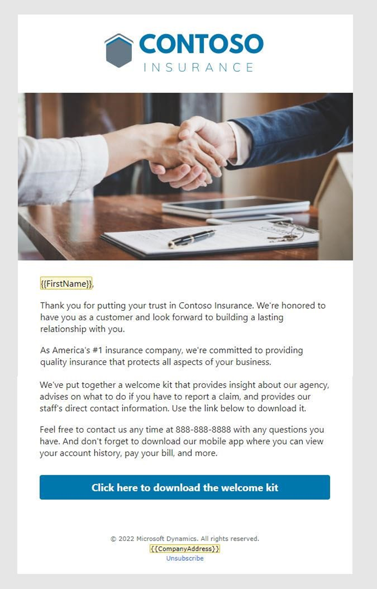
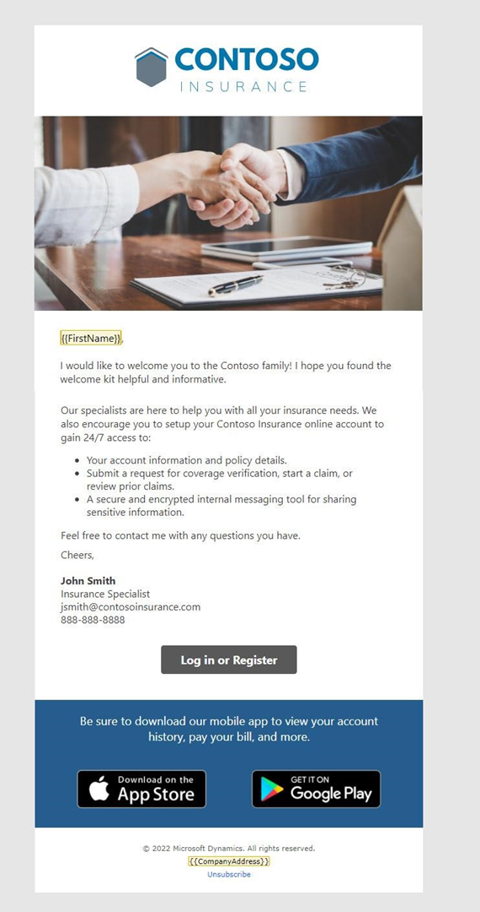
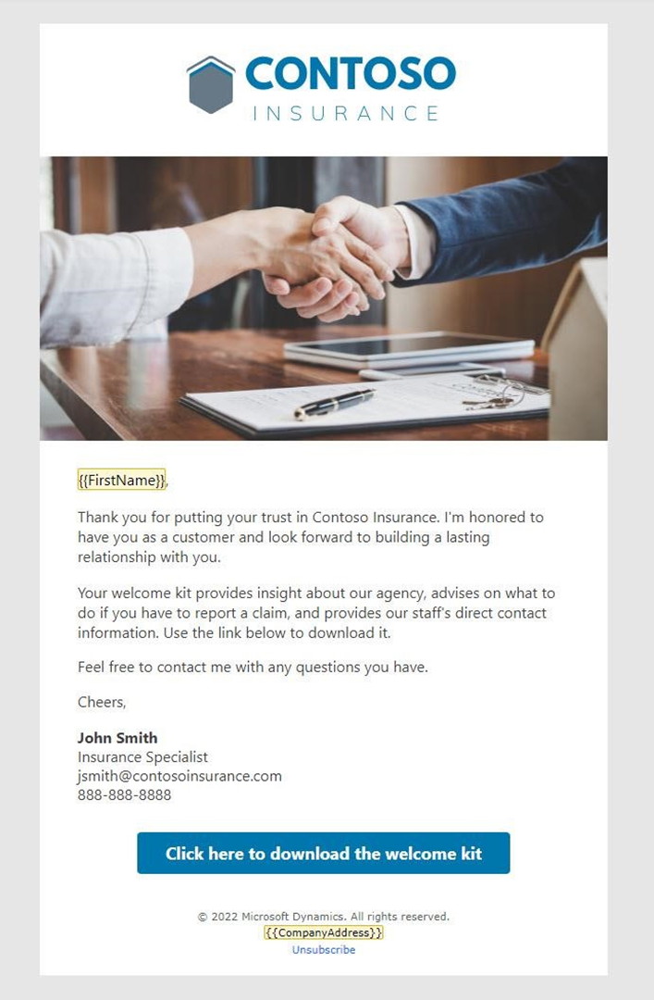

---
lab:
  title: 实验室 1：创建电子邮件
---

## 实验室 1：创建电子邮件 

在本实验室中，你将学习如何：
- 创建在旅程中使用的电子邮件
- 在电子邮件中使用上传的资产
- 检查电子邮件内容并上线

### 任务 1：创建第一封电子邮件
1. 登录到 Dynamics 365 Customer Insights - Journeys。

1. 导航到**实时旅程**工作区。

1. 在“频道”下，选择“**电子邮件**”。

1. 创建电子邮件。
   - 单击“**+新建**”以创建新电子邮件。
   - 从模板库中，选择“**跳过**”。

1. 输入有关电子邮件的详细信息。
   - 名称：欢迎电子邮件 1
   - 主题：欢迎来到 Contoso Insurance
   - 预览文本：我们致力于为你提供高质量保险。

1. 选择默认品牌配置文件作为品牌配置文件。

1. 导航到“**设置**”并展开“**符合性**”。 确保“目的”设置为“**商用**”。

1. 设计电子邮件。 请参阅以下欢迎电子邮件 1 的屏幕截图，了解设计和内容创意，并使用你在设置说明中上传的主图。 可以根据需要修改图像和内容，但你希望在此电子邮件中包含一个行动号召按钮，因为它将用作旅程中的分支条件。

     

1. 下面是此电子邮件的一些示例副本。 可以将此项复制并粘贴到电子邮件设计中。 使用“**个性化**”设置输入联系人名字的动态内容。 

    ```
    {{FirstName}},
    
    Thank you for putting your trust in Contoso Insurance. We're honored to have you as a customer and look forward to building a lasting relationship with you. 
 
    As America's \#1 insurance company, we're committed to providing quality insurance that protects all aspects of your business. 
 
    We've put together a welcome kit that provides insight about our agency, advises on what to do if you need to report a claim, and provides our staff's direct contact information. Use the link below to download it. 
 
    Feel free to contact us any time at 888-888-8888 with any questions you have. And don't forget to download our mobile app where you can view your account history, pay your bill, and more. 
    ```

1. 向电子邮件添加按钮。 

    - 在工具箱中，选择“**元素**”选项卡。 
    - 将按钮拖到主文本下方。 
    - 将 URL 更改为 contoso.com。 
    - 展开“样式”部分。 
    - 将按钮颜色更改为 #0076ad。 

1.  预览、测试和上线你的电子邮件。 

    - 导航到电子邮件的“**预览和测试**”选项卡以查看电子邮件。 
    - 使用“**测试发送**”向自己发送一份副本。 输入个人电子邮件地址。 选择之前创建的联系人 - 将通过“个性化”填写此联系人的名字。 如果未在收件箱中看到电子邮件，请务必检查垃圾邮件文件夹。 
    - 进行任何最终更改。 
    - 单击“**检查内容**”。 如果需要，更正任何错误。 
    - 单击“**准备发送**”。 

### 任务 2：创建第二封电子邮件
我们将通过复制刚刚创建的电子邮件来创建另外两封电子邮件。

1. 当欢迎电子邮件 1 处于打开状态时，单击“**保存**”旁边的下拉菜单，然后选择“**另存为**”。

1. 将电子邮件的名称更新为“**欢迎电子邮件 2**”。 

1. 单击**保存并关闭**。

1. 在弹出窗口中选择“**查看记录**”以移动到新创建的电子邮件。 （如果未弹出此窗口，请转到“**电子邮件**”并选择“**欢迎电子邮件 2**”。）

1. 更改主题和预览文本。
    - 建议的**主题：** 获取 Contoso Insurance 门户的按需访问权限。
    - 建议的**预览文本：** 查看帐户信息、策略详细信息以及提交索赔等。

1. 设计电子邮件。 有关设计和内容创意，请参阅下面欢迎电子邮件 2 的屏幕截图。 可以根据需要修改图像和内容。 

     

1. 下面是此电子邮件的示例副本。 可以将此项复制并粘贴到电子邮件设计中。 （备注：建议保留第一封电子邮件中的 FirstName，然后将副本的其余部分替换为此项。） 

    ```
    I would like to welcome you to the Contoso family! Our specialists are here to help you with all your insurance needs. We also encourage you to setup your Contoso Insurance online account to gain 24/7 access to:  
        -   Your account information and policy details. 
        -   Submit a request for coverage verification, start a claim, or review prior claims. 
        -   A secure and encrypted internal messaging tool for sharing sensitive information. 
    Feel free to contact me with any questions you have. 
        
    Cheers, 
    John Smith, Insurance Specialist   jsmith@contosoinsurance.com 
    888-888-8888 

1. Preview, test, and go live with your email.

### Task 3: Create your third email
We will create one final email by copying email 2.

1. Create a new email by copying email 2. Name the email Welcome email 3. 

1. Enter details about the email.
    - Suggested **Subject:** Welcome to Contoso
    - Suggested **Preview text:** Review your welcome information.

1. Design the email. Refer to the screenshot of Welcome Email 3 below for design and content ideas. You can modify the images and content as desired. 

     

1. Here is sample copy for this email. You can copy and paste this into your email design. (Note: We recommend leaving FirstName from the first email and then replacing the rest of the copy with this.) 

    ```
    感谢你信任 Contoso Insurance。 你能成为客户我倍感荣幸，期待与你建立持久的关系。 欢迎工具包提供有关我们代理的见解，给出在必须报告索赔时的建议操作，并提供员工的直接联系人信息。 

    使用以下链接从网站下载该工具包。
    
    如果有任何问题，请随时联系我。 祝好，保险专家 John Smith   jsmith@contosoinsurance.com 888-888-8888
    ```

1. Update the button in the email. In the **Button text** field, change it to **Click here for the welcome kit.**

1. Preview, test, and go live with your email.
