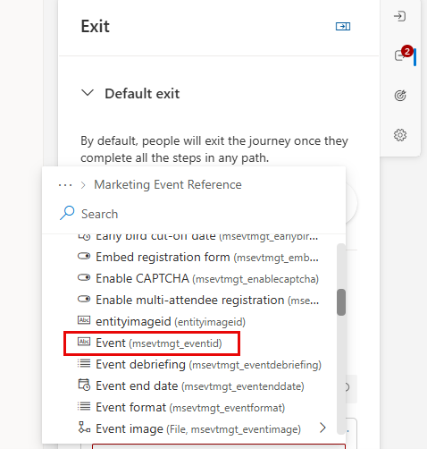

---
lab:
  title: 实验室 3：创建基于客户细分的旅程
---
## 实验室 3：创建基于客户细分的旅程 

在本实验室中，你将学习如何：
- 创建基于客户细分的旅程 
- 定义客户细分的退出条件 

### 任务 1：创建基于客户细分的旅程 
Contoso 希望能够与满足特定人口统计条件的客户互动。 为此，他们将创建基于细分的旅程。

1. 在“参与”下，选择“**旅程。**”

1. 在命令栏中单击“**+ 新建旅程**”。

1. 选择“**跳过并从空白处创建。**”

1. 在“命名旅程”中，输入**西雅图市场活动。**

1. 在“选择旅程类型”中，选择“**基于客户细分。**”

1. 在“选择细分”中，选择“**西雅图客户。**”

1. 在“选择频率”中，选择“**重复旅程，其中所有受众成员每次重复旅程：**”

1. 选择“**6 周。**”

1. 将时区设置为你所在的时区。

1. 将开始日期设置为今天的日期，从现在起 30 分钟。

1. 将结束日期设置为从今天起大约六个月。

1. 单击 **“创建”** 。

1. 在右侧的“旅程”设置中，确保已选择“**条目**”部分。

1. 转到“**按细分市场排除**”并选择“**业务客户。**”

### 任务 2：定义旅程退出条件
由于此旅程的目标是推动人们注册参与市场营销活动，我们希望确保在他们注册后，无论他们在旅程的哪个阶段，旅程都会结束。  此外，如果任何 Contoso 员工住在西雅图，我们希望他们知道即将到来的活动；然而，我们不希望他们经历旅程本身。 因此，我们将限制谁可以继续旅程。  

1.  选择“**退出**”部分。  

1.  然后，在“**触发时退出**”部分下，选择“**市场营销活动注册已创建。**”

1.  选择“添加条件”。

1.  展开“**已创建的市场营销活动注册**”，然后展开“**市场营销活动参考。**”

1.  选择“**事件。**”

    

1.  将运算符设置为**等于。**

1.  将值设置为 **Ted Contoso。**

1. 在“**退出按段**”中，将值设置为 **Contoso Customers。** 

### 任务 3：构建旅程
现在我们已经定义了与此旅程相关的不同标准，接下来我们将创建旅程本身。  

1. 在旅程设计器中，单击“创建的联系人”磁贴下的“**加号图标 (+)**”。

1. 选择“**属性分支（基于特定值的分支）。**”

1. 在右侧的“显示名称”中，将属性命名为**新业务客户。**

1. 选择“**分支 1**”，在“选择属性”中，搜索**联系人。** 下的**描述（描述）**

1. 将值从“等于”改为“**包含。**”

1. 在“值”中，输入“**业务。**”

1. 单击“分支 1”下的**加号图标 (+)**。

1. 选择“**电子邮件：发送电子邮件。**”

1. 在“选择电子邮件”中，选择“**欢迎电子邮件 1。**”

1. 单击“发送电子邮件”磁贴下的**加号图标 (+)**。

1. 选择“**等待触发器。**”

1. 在右侧的 If/then 分支面板中，在“等待”下，选择分支条件类型，选择“**上一条消息获取交互。**”

1. 在“选择交互”中，选择“**已单击电子邮件链接。**”

1. 在“**时间限制是多少？**”中，输入10 分钟。

1. 返回“旅程”图，若要指定单击的链接，请选择“**创建分支。**”

1. 选择属性“**单击的电子邮件链接。**”

1. 在分支 1 中，选择链接，从电子邮件中选择“调用操作”按钮。

1. 在按钮单击的路径下，单击“**加号图标（+）。**”

1. 选择“发送电子邮件”****。

1. 在“选择电子邮件”中，选择“**欢迎电子邮件 2。**”

1. 在相应的“无路径”中，单击“**加号图标（+）。**”

1. 选择“发送电子邮件”****。

1. 在“选择电子邮件”中，选择“**欢迎电子邮件 3。**”

1. 保存旅程。

1. 查看旅程。 进行任何最终更改。

1. 单击“发布”****。 等待旅程发布。

