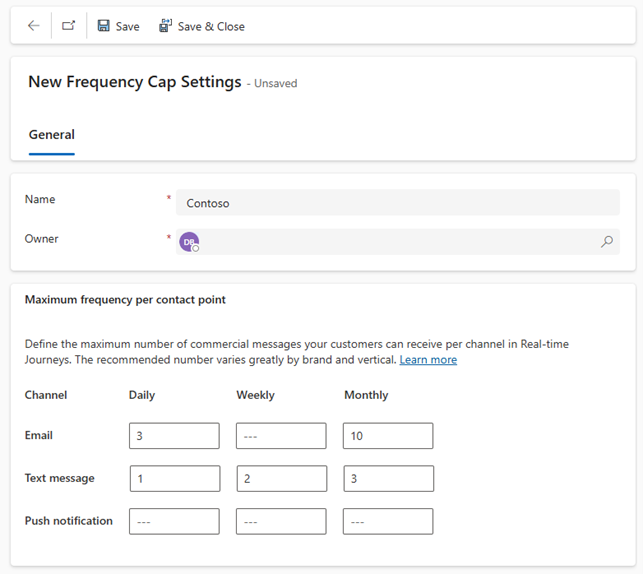

---
lab:
  title: 实验室 4：创建基于触发器的旅程
---

## 实验室 4：创建基于触发器的旅程 

在本实验室中，你将学习如何：
- 创建基于触发器的旅程
- 定义客户细分的退出条件 

### 任务 1：创建基于触发器的旅程 
1. 导航到**实时旅程**工作区。

1. 在“**参与**”下，选择**旅程**。

1. 在命令栏中单击“**+ 新建旅程**”。

1. 选择“**跳过并从空白处创建。**”

1. 在“**命名旅程**”中，输入“**欢迎旅程。**”

1. 在“**选择旅程类型**”中，选择“**基于触发器**”。

1. 在“**选择触发器**”中，搜索并选择“**已创建联系人。**”

1. 单击 **“创建”** 。

1. 从右侧的“旅程设置”中，在“条目”部分选择“**添加条件。**”

1. 在“属性”下拉菜单中，选择“**已创建的联系人 > 联系人（联系人）> 帐户（帐户）> 帐户名称。**”

1. 将运算符更改为“**不等于。**”

1. 将值设置为 **Humongous Insurance**。 条件应读取**帐户名称不等于 Humongous Insurance。**

1. 按如下所示在“条目”部分中配置其余项：
    - 在“**重复**”部分，选择“立即”。
    - 在“时区”部分，选择时区。
    - 在“开始”菜单中，选择“今天，从现在开始 15 分钟后。”
    - “结束”，选择明天。

### 任务 2：定义旅程目标
接下来，我们可以确定客户旅程的特定目标。  目标有助于确定旅程的终点。  这些可以是促成购买或与客户互动之类的事情。  为旅程提供目标可确保在达到目标后停止旅程。    

对于此旅程，我们希望有一定比例的参与人员，以点击我们发送的电子邮件中的链接。  

1.  从右侧的“旅程”设置中，导航到“**目标**”部分。

1.  在“**此旅程的目标是**”中，选择“**发送常规通知**”。

1.  在“**目标实现时**”字段中，选择“**一人点击了至少一个链接。**”

1.  在“**所需人数**”中，输入 **50**。 将“**百分比**”选项保留为选中状态。 

### 任务 3：定义旅程的频率上限 
Contoso 希望确保不会向客户发送大量商业信息。 为了确保这不会发生，他们希望对此旅程设置频率上限。   

1.  从右侧的“旅程”设置中，导航到“**其他设置**”部分。

1.  在“频率上限”下，确保已选择“**对此旅程设置频率上限 – 如果已达到上限，请跳过商业消息**”。  

1.  在“跨旅程的最大频率”下，选择“**转到频率上限设置。**” 此时将打开一个新的窗口。

1.  在命令栏上，选择“**+ 新设置。**”

1.  在名称字段中输入 **Contoso。**

1.  在“每个联系点的最大频率”部分中，根据下图进行配置：

    

1. 选择“**保存并关闭**”以保存并关闭新的频率上限设置。  

1.  返回到包含欢迎旅程的窗口。 **保存**旅程并刷新浏览器。

1.  从右侧的“旅程”设置中，再次导航到“**其他设置**”部分。

1.  请注意，Contoso 频率上限现在应用于此旅程。  

### 任务 4：构建基于触发器的旅程 
现在我们已经定义了必要的旅程条件，下一步是构建实际的旅程步骤。 

1. 在旅程设计器中，单击“创建的联系人”磁贴下的“**加号图标 (+)**”。

1. 选择“**属性分支（基于特定值的分支）。**”

1. 在右侧的“显示名称”中，输入“**新业务客户。**”

1. 选择“**分支 1**”，在**选择属性**中，搜索联系人下的“**描述（描述）**”。

1. 将值从“等于”改为“**包含。**”

1. 在“值”中，输入“**业务。**”

1. 单击“分支 1”下的**加号图标 (+)**。

1. 选择“**电子邮件：发送电子邮件。**”

1. 在“**选择电子邮件**”中，选择“**欢迎电子邮件 1。**”

1. 单击“发送电子邮件”磁贴下的**加号图标 (+)**。

1. 选择“**等待触发器。**”

1. 若要配置 If/then 分支，请在右侧的 If/then 分支面板中，在“等待”下选择分支条件类型，选择上一条消息以获取交互。

1. 在“**选择交互**”中，选择“**已单击电子邮件链接**”。

1. 在“**时间限制是多少？**”中，输入10 分钟。

1. 返回“旅程”图，若要指定单击的链接，请选择“**创建分支。**”

1. 选择属性“**单击的电子邮件链接。**”

1. 在分支 1 中，从电子邮件中选择“调用操作”按钮。

1. 在“是”路径中，单击“**加号图标 (+)。**”

1. 选择“发送电子邮件”****。

1. 在“选择电子邮件”中，选择“**欢迎电子邮件 2。**”

1. 在相应的“无路径”中，单击“**加号图标（+）。**”

1. 选择“发送电子邮件”****。

1. 在“选择电子邮件”中，选择“**欢迎电子邮件 3。**”

1. 保存旅程。

1. 查看旅程。 进行任何最终更改。

1. 单击“发布”。**** 等待旅程发布。

